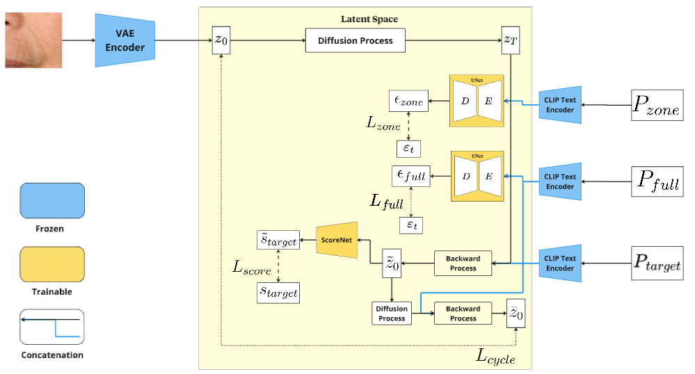
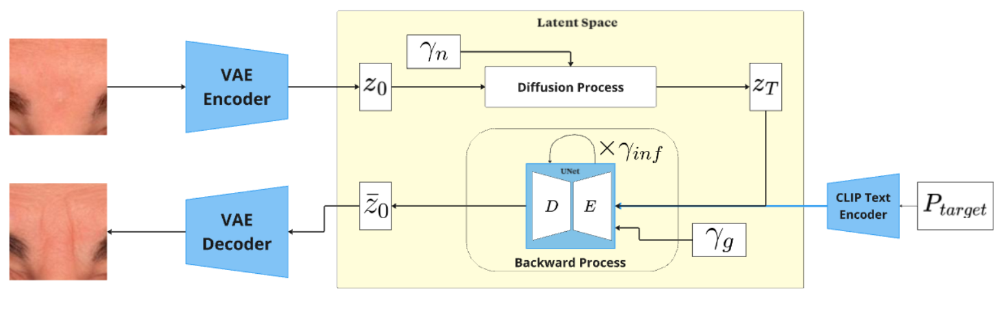
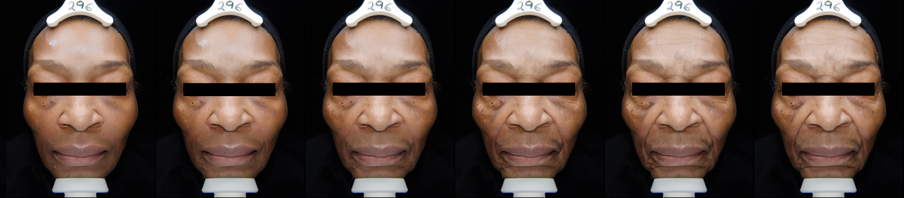
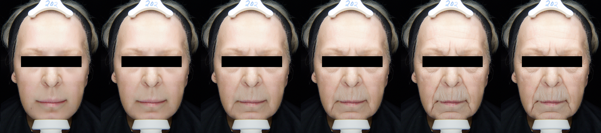
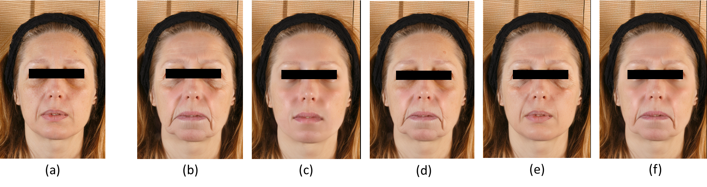

# Locally Controlled Face Aging with Latent Diffusion Models

    <h2 align="center">
        <a href="https://fr.linkedin.com/in/lais-isabelle-alves-dos-santos">Lais Isabelle Alves dos Santos</a>
        <a href="https://www.linkedin.com/in/juliendespois/">Julien Despois</a>
        <a href="https://fr.linkedin.com/in/thibautchauffier">Thibaut Chauffier</a>
        <a href="https://fr.linkedin.com/in/sileyeba">Sileye O. Ba</a>
        <a href="https://fr.linkedin.com/in/giovanni-palma-27847aa">Giovanni Palma</a>
    </h2>

  

## Abstract
We present a novel approach to face aging that addresses the limitations of current methods which treat aging as a global, homogeneous process. Existing techniques using GANs and diffusion models often condition generation on a reference image and target age, neglecting that facial regions age heterogeneously due to both intrinsic chronological factors and extrinsic elements like sun exposure. Our method leverages latent diffusion models to selectively age specific facial regions using local aging signs. This approach provides significantly finer-grained control over the generation process, enabling more realistic and personalized aging. We employ a latent diffusion refiner to seamlessly blend these locally aged regions, ensuring a globally consistent and natural-looking synthesis. Experimental results demonstrate that our method effectively achieves three key criteria for successful face aging: robust identity preservation, high-fidelity and realistic imagery, and a natural, controllable aging progression.

## Paper

    
     
        
    

    

        

            L. Alves dos Santos, J. Despois, T. Chauffier, S. Ba, G. Palma 
            
                <b>Locally Controlled Face Aging with Latent Diffusion Models.</b>
            
             
            ICCV, 2025 (P13N Workshop)
            <a href="https://arxiv.org/abs/2507.21600" target="_blank">[arXiv]</a>&nbsp;<a href="bibtex.txt" target="_blank">[BibTeX]</a>&nbsp;
        

    

## Model Training and Inference
Our model based on latent diffusion models to achieve locally controlled face aging. Rather than relying on age as a parameter, the focus is placed on the natural evolution of face wrinkles by relying on locally normalized aging scores. Each part of the face is generated individually, using a target score as a condition for each zone, rather than generating the entire face as a whole. The generated crops are then blended to produce full-face images, an approach that yields smoother and more realistic results. Our approach maintains the core idea of Stable Diffusion of doing the denoising-diffusion in the latent space. It employs three distinct prompts: Pfull, that ensures the model performs the task from a global perspective, Pzone, helps the model identify the specific crop zone and focus on increasing or decreasing wrinkles, and Ptarget, used to guide the initial step of the latent cycle consistency loss.

  

The second stage of our method consists of an input image being translated to the latent space. This latent embedding is diffused according to a noise strength γn. After the diffusion process, the backward step consists of performing γinf denoising steps. Additionally, the guidance scale, γg, regulates the importance the text prompt has over the backward process in the attention layers of the network.

  

## Results
### High Quality Images Dataset
We assembled a high-quality image dataset as the initial dataset for this work. It contains 6000 high-resolution (3000 × 3000) images of faces, centered and aligned, covering a broad spectrum of ages (18-80), genders, and self-reported ethnicities. The zones considered in this work primarily correspond to areas prone to wrinkle development, including the glabellar region, nasolabial folds, inter-ocular area, upper lip, under-eye region, corners of the lips, and crow’s feet.

  

    
  

  

    
  

We also demonstrate the control over different zones of the face, where **(a)** is the original image, **(b)** is the entire face aged, **(c)** is the entire face rejuvenated, **(d)** is the bottom face zones aged, **(e)** is the top face zones aged, and **(f)** has some zones with a higher score, others with a lower score than (a).

    

